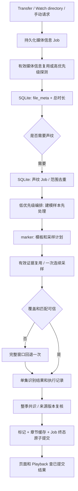

# 声纹自适应采样优化设计

日期：2026-10-08。代码研究起点：`main@0fd078e`；交付时产品代码为 `6fc3f9c`，新增章节场景图回退，不改变本文核对的声纹采集和强制入队行为。

状态：供用户审阅的设计草案；本次交付是方案，未实现下述接口、迁移或算法。配套实施计划：[Implementation Plan](../plans/2026-10-08-adaptive-fingerprint-sampling.md)。

## 1. 需求与成功条件

用户希望同季多集片头片尾相同时，减少重复的远程音频读取；同时需要每集准确的起止时间、可追踪的持久化 Job、详细耗时日志，以及真实 STRM 的整季性能结果。

已明确的行为约束：

- 媒体信息是必需数据，先提取并写入 SQLite；声纹是可选的后台工作，关闭声纹或 TheIntroDB 不得阻止媒体信息提取。
- 自动处理复用未变化文件的采集证据。用户手动点击片头片尾生成，要执行新的采集和识别；已有同范围 Job 时返回“正在生成”，不得重复排队。
- 重算期间显示旧标记；整季结果和章节缓存提交成功后才展示新结果。采集、数据库或发布失败时保留旧结果。
- 单集片头片尾不能直接复制其他集的时间戳。合法片头可以从 `0:00` 开始；是否准确必须同时检查结束点和实际内容。
- 远程媒体探测、声纹采集继续直连，清除代理环境；Playback 的现有直连行为不得回退。
- 所有网络、重试、采样和比对必须有可关联的日志；“PCM 输出字节数”不得称为“远程下载字节数”。

本文作出的设计选择：先采用“少数集完整发现模板，其他集按预测完整区间验证，失败一次后回到完整窗口”。短锚点随机抽样、多次小块 seek 不作为首版默认路径。提速门槛是实验验收目标，不能作为已经达到的结果。

## 2. 当前实现和实际限制

| 当前代码 | 已存在的能力或限制 | 本次处理方式 |
|---|---|---|
| `crates/api/src/probe_manager/worker.rs` | 媒体信息队列优先；声纹单独一个 worker | 保留；在采样间隙让出执行机会，正在读取的样本执行至完成或失败 |
| `crates/api/src/probe_manager/probe.rs` | 先获取媒体信息，随后分别采片头和片尾；同一个 reuse flag 同时控制两种缓存 | 分开控制媒体信息复用和声纹重采 |
| `crates/api/src/http/library_chapters.rs` → `ProbeManager::enqueue_marker_refresh` | 入口设置 `reuse_fingerprint_cache=false`，整季入队又强制改为 true | 修复手动“强制生成”可能只重分析旧指纹的语义冲突，不能将此计作重采提速 |
| `crates/api/src/fingerprint_job/cache.rs` | 自动模式按集持久缓存；默认两段各 180 秒 | 支持带绝对起点的多个连续窗口，继续接纳旧完整窗口缓存 |
| `crates/api/src/fingerprint_job/cache_key.rs` | 缓存键含采样时长、总时长、匹配时长约束 | 分离采集 profile、窗口、分析 policy，改匹配规则不再要求重新读取媒体 |
| `crates/marker/src/matcher/consensus.rs` | 两两比对，支持跨集共识 | 复用候选匹配和聚类；支持导出模板证据，保留完整比对回退 |
| `crates/store/src/probe_tasks.rs` | Job/单集状态持久化、活动范围去重、启动恢复 | 扩展计划、执行阶段和采样结果；不另建内存状态事实来源 |
| `crates/store/src/library.rs` | 标记、章节缓存和刷新终态原子提交 | 保留原子提交；该文件已 819 行，修改时按标记职责拆分 |
| `crates/marker/src/fingerprint/chromaprint/*` | FFmpeg 首个 PCM、读等待、CPU、PCM 字节等诊断 | 扩展为可返回的结构化度量，按 attempt 持久汇总 |

默认采样窗口 `W=180s`，一次无缓存处理最多覆盖每集开头和结尾各 180 秒。8 集最多累计覆盖 2,880 秒，即 48 分钟媒体时间。这不是 48 分钟执行时间，也不代表只下载相应体积的音频；复用完整缓存的重分析可不打开媒体流。

现有 8 集缓存比对的毫秒级合成测试只测匹配计算，不包含排队、ffprobe、远程连接、seek、解码和数据库提交，不能用来宣称整季生成只需几十毫秒。

远程 MKV/MP4 通常复用交织封装。`-vn` 关闭视频输出，并不保证网络只传音频包。输入 `-ss` 可能先跳至更早的可 seek 点，再解码丢弃多余内容；增加小窗口次数可能增加总耗时。[FFmpeg 官方流选择和 seek 文档](https://ffmpeg.org/ffmpeg.html#Stream-selection)。

另一个已知限制：STRM 的当前版本标识来自本地路径、stat 和 STRM 内容，不是远程媒体内容哈希。相同 URL 后的媒体字节被替换可能无法自动发现；手动重采必须仍然生效。首版不凭同名、同大小、同总时长推断两个文件内容相同。

## 3. 方案比较与选型

| 方案 | 收益 | 准确性与实现成本 | 结论 |
|---|---|---|---|
| 每集完整采集并持久缓存 | 再次分析基本不读流；实现简单 | 首次和强制重采仍读取两段完整窗口 | 保留为基准和回退 |
| 模板引导的一次连续区间验证 | 常规集只读实际候选时长和上下文；每集仍有直接证据 | 需要模板、覆盖检查、独立版本和失败回退 | 首版推荐 |
| 10–20 秒锚点或多个稀疏块 | 理想情况下定位成本低 | 开流/seek 次数多；中间命中不能证明完整长度、剪辑和边界 | 暂不实现；以后单独做实验 |
| 指纹倒排索引/LSH 代替全部两两比对 | 大样本库的 CPU 比对减少 | 不能减少为生成指纹而读取的媒体字节 | 普通一季规模暂不优先 |

模板优化是本项目的设计提案，不能声称上游已经用相同参数实现。Jellyfin Intro Skipper 的公开文档支持按文件生成指纹、跨文件查找重复区间、按媒体版本复用检测缓存、从缓存重新分析；其章节和黑帧检测是不同证据来源。[Intro Skipper 检测与重分析说明](https://github.com/intro-skipper/intro-skipper/wiki#analysis-and-re-analysis)。

MediaInfoKeeper 的 `IntroScanRunner` 有按条目去重、可配置并发、预先补媒体信息和检测耗时日志；实际声纹生成与季序列更新调用 Emby 的 `AudioFingerprintManager`。它不能提供其所调用闭源检测器的完整算法证明。[IntroScanRunner 源码](https://github.com/honue/MediaInfoKeeper/blob/master/Services/IntroScanRunner.cs)。借鉴其工作生命周期，继续使用本项目的 SQLite、trait 和 Rust matcher。

## 4. 模块边界与数据流

- `marker`：纯模板、窗口规划、证据验证，以及可替换采集 trait；不读取 Store，不调用 API，不负责排队。
- `store`：SQLite 中的样本、模板 JSON、执行记录和提交事务；只保存数据，不能反向依赖 `api`。Store DTO 使用原始字段和版本化 JSON，不依赖 API 类型。
- `api::fingerprint_job::adaptive`：协调缓存、采集和纯算法，返回带来源的单集结果。
- `api::probe_manager::season`：使用既有持久化 Job 编排一季，处理恢复、去重和原子发布。
- 前端：轮询既有 `probe-status` 和已提交章节，展示活动状态；不触发额外采集，不推导标记时间。

不在本轮增加共享的跨 Media 声纹库、新消息队列或新的代理读取层。

## 5. 采集模式、版本与 API 行为

### 5.1 模式

| 场景 | 采集政策 | 媒体信息政策 | 发布行为 |
|---|---|---|---|
| 文件首次出现或变化 | `ReuseValid` | 有效则复用，否则探测 | 自动 Job 完成后更新有直接证据的标记 |
| 用户点击片头片尾生成 | `Recapture` | 有效则复用，否则探测 | 每个参与集重新采集；旧标记一直可见，整季原子替换 |
| 用户点击媒体信息刷新 | 按现有显式选项决定 | `Refresh` | 媒体信息独立持久化、独立终态 |
| benchmark 的缓存重分析 | `ReuseValid` | 复用 | 仅实验库；不得被包装成生产按钮的强制重采 |

`Recapture` 不使用旧样本满足本次完成条件；三个建模集也要从本次新采样建立模板。恢复同一个 Job 时可以复用该 Job 已完成并持久化的样本，避免重启后从零开始。旧样本可保留用于失败后的展示和诊断，不能成为新采集的替代。

识别片头片尾的手动动作即使自动声纹开关关闭也可按现有显式强制逻辑运行；TheIntroDB 开关只控制公共查询，不能控制本地声纹或媒体信息。

### 5.2 三种独立版本

1. `source_version`：沿用现有保守来源版本；来源变化失效该集样本以及引用它的模板成员。
2. `capture_profile_key`：由 Chromaprint preset、算法版本、PCM 参数、选中音轨和时间映射版本决定；不包含匹配阈值和窗口长度。
3. `analysis_policy_key`：匹配阈值、时长约束、边界策略、模板模型版本和搜索范围；变化只重分析可用样本。样本覆盖不足才补读。

单个采样窗口的起止点独立加入证据键。某个缓存的连续窗口包含所需区间和上下文时，可直接用该完整样本分析；不拼接独立指纹数组，不伪造连续性。

## 6. 模板发现

### 6.1 建模集选择

按 `(episode, ledger_id)` 排序，相同逻辑集有多个文件版本时，每个版本仍独立验证，不能互算成两个独立支持集。初始建模预算为三个不同集号：

- `N >= 6`：选择索引 `1`、`(N-1)/2`、`N-2`，去重后补足三个。
- `2 <= N < 6`：按顺序取至多三个不同集号。
- `N < 2`：不形成跨集模板，执行既有可用证据检查，返回明确的 `insufficient_peers`。

自动模式优先利用有效完整样本，同等条件按上述顺序；强制模式按上述顺序新采。模板不足时只从尚未处理的不同集号中补两个完整建模样本，总建模预算至多五集。仍不稳定时，其余集直接完整采集。失败样本不计支持。

### 6.2 模板结构和共识

片头和片尾分别建模，分别做决定。模板保存整个公共区间和前后上下文，不能只保存一个中心锚点；保留最多三个满足证据条件的候选版本，不强制全季只有一种。

模板成员来自独立集号。两个一致成员可产生仅用于窗口预测的候选；三个一致成员才允许快速验证。最终发布的支持数仍满足既有季阈值：`N < 6` 至少 2 集，否则 `max(3, ceil(N*20/100))`。未达到最终阈值的模板不得生成最终标记。

两个不同文件版本的同一集只算一个支持；不把一次 pair match 同时当作两个独立验证。

## 7. 连续窗口规划与精确验证

### 7.1 参数

| 参数 | 首版值 | 含义 |
|---|---|---|
| `seed_count` / `max_seed_count` | 3 / 5 | 完整发现的不同集号预算 |
| `max_templates_per_kind` | 3 | 同类候选版本上限；溢出回到完整比对 |
| `context_margin_ms` | 10,000 | 模板预期区间左右保护范围 |
| `min_window_saving_ratio` | 0.15 | 相对完整窗口预计至少减少 15% 媒体时间才尝试快速路径 |
| `min_match_duration_ms` / `max_match_duration_ms` | 15,000 / 240,000 | 沿用现有匹配长度限制 |
| `max_score` | 4.0 | rusty-chromaprint 的原始 0–32 score，越低越相似；是待校准阈值，不是概率 |
| `min_reference_coverage` | 0.95 | 目标集匹配至少覆盖模板公共区间的 95% |
| `max_internal_gap_ms` | 1,000 | 不跨明显内部断点合成完整片段 |
| `max_reference_boundary_delta_ms` | 1,000 | 两个独立模板成员映射到目标集的边界差上限 |
| `min_guard_evidence_ms` | 3,000 | 验证左右边界不只是采样截止造成的边缘 |
| `template_edge_anchor_ms` | 15,000 | 模板起点和终点两端都必须被目标证据覆盖，中心命中不能补齐边界 |
| `max_windows_per_kind` | 2 | 一次预测窗口和至多一次完整窗口回退 |
| `max_attempts_per_kind` | 4 | 包含两种窗口和网络重试的总进程尝试数，不能乘成 2×4 |
| `process_deadline_ms` | 120,000 | 一次 FFmpeg 全进程主动超时，杀进程并 wait 回收 |

采集继续为单声道、16,000Hz、s16le、`preset_test2`。初版默认 `fingerprint_sampling_mode=full_window`；只有准确性和性能验收通过后才对测试范围选择 `adaptive`。不预设切换全实例的日期。

### 7.2 预测

片头用模板成员的绝对开始/结束位置分布；片尾用成员距离媒体末尾的开始/结束距离分布，再根据目标集已保存的总时长转换。不能把某集的绝对片尾时间复制给另一集。

每类候选范围取成员边界的最小/最大预测包络，左右扩大 `context_margin_ms`；保护范围至少覆盖 Chromaprint 的窗口滤波延迟及两个 fingerprint item。所有候选包络合并为一个连续验证窗口，并限制在本次既定搜索范围内。多个相隔很远的候选使窗口太大时，直接完整采集，不分别开三次流。

完整回退范围沿用配置 `W=fingerprint_duration_secs`：片头 `[0,min(W,D)]`，片尾 `[max(0,D-W),D]`。不在优化时悄悄缩小原来的搜索范围。模板被完整样本边界截断时不能作为完整模板；搜索上限不足返回 `sampling_limit`，不把截断长度发布为已确认完整片头。

预计收益除了采样秒数，还要使用该来源过去尝试的首 PCM 等待和读取速率作成本估计。`origin_key` 只对 scheme/host/port 做 hash，统计范围为 `(job_id, origin_key, kind)`，不包含 URL 签名。至少有三次有效度量时，设首 PCM 等待为 H、采样毫秒/执行毫秒速率为 R、最近回退率为 P，比较 `C_full=H+full_ms/R` 和 `C_adaptive=H+verify_ms/R+P*C_full`，仅在后者不超过前者 90% 时尝试快速路径。

没有历史成本时只使用 15% 窗口缩减门槛；最近五次同源快速尝试中至少三次回退，就让该 Job 余下同类集直接完整采集，记录 `fast_path_disabled_unstable`。历史统计只做性能提示，不能使 Job 丢失或跳过准确性检查。

### 7.3 验证与边界

同一个目标连续样本对至少两个独立参考成员运行候选匹配，必须同时满足长度、score、覆盖率、内部连续性、边界一致和采样覆盖条件。模板公共区间最前/最后各 15 秒都须有对应目标证据（模板短于 30 秒时两锚点允许重叠）；不能仅凭中间 95% 相同认定未匹配的末尾。结果必须使用目标集自己的匹配坐标；模板边界只是预测，不能用模板固定时长补齐目标结果。

short sample 命中中心 20 秒但不覆盖模板整段时，结果只能为 `needs_full_window`。模板结束点后仍有连续共同声纹、候选碰到非媒体边缘的样本截止点、采集实际 PCM 时长不足、两个参考给出不同版本时，同样回退。完整回退仍裁断候选则返回 `sampling_limit`。

时间映射由一个公共 helper 负责：`absolute_ms = sample.window.start_ms + matcher_relative_ms`。fingerprint item 时长从 `Configuration::item_duration_in_seconds()` 获取；滤波延迟用于上下文和边缘可用范围，不盲目给所有标记加一个固定延迟。用具有已知起止点的 PCM/容器 fixture 校准，不写死“每点 0.128 秒”。[当前使用库的时间和 score 定义](https://github.com/darksv/rusty-chromaprint)。

非零起始 PTS、输入 seek 的解码丢弃、音频编码延迟分别通过 fixture 检验归一化。没有可验证时间映射的来源不走快速路径；日志返回限制原因。合法媒体边缘（片头真正从 0 开始、片尾到媒体结尾）可以缺少一侧保护区，仍需要其他参考和覆盖证据。

短窗口与完整窗口由同一个 FingerprintEngine 实现匹配。替换采集器后，如果无法提供实际采集覆盖信息，仅允许完整回退路径。

## 8. 持久化与恢复

新增数据都保存在现有 `library.db`，复用 `probe_jobs` / `probe_job_units`。本次不把历史队列整体迁移到 ADR-0009 的通用 Job 表；当前探测队列与 ADR 的位置差异须在实施记录中明示。

### 8.1 样本与模型

- `fingerprint_samples`：`sample_id` 主键，`ledger_id`、`source_version`、`capture_profile_key`、`kind`、窗口绝对起止、实际 PCM 时长、指纹 JSON、`captured_job_id`、`captured_at_ms`、度量 JSON。唯一键为 `(ledger_id, source_version, capture_profile_key, kind, window_start_ms, window_end_ms)`。
- `fingerprint_season_models`：`model_id` 主键，`media_id`、`season`、`kind`、`model_version`、`membership_key`、`policy_key`、模型 JSON、创建时间。JSON 必须保存参考的 sample_id、来源版本和各自坐标；引用失效后不再可用。
- `fingerprint_model_members`：`(model_id, sample_id)` 主键，保存成员的 `ledger_id` 和 `source_version`，在删除样本前删除所有引用它的模型，避免 JSON 内残留引用被误用。
- `probe_job_units` 加 `sampling_plan_json`、`detection_outcome_json`、`reuse_media_info_cache`；Job 加 `analysis_policy_key`、`sampling_mode`。旧运行记录可恢复，无法还原的计划重建为完整模式。
- `fingerprint_attempts`：`attempt_id`、Job、ledger、kind、窗口、阶段、开始/结束、状态、错误分类、度量 JSON。执行前写入 running；完成后在同一事务写样本和成功记录。

旧 `fingerprint_cache` 保留兼容入口。仅在能够验证旧 cache key、来源和 profile 的情况下包装成完整样本；旧缓存匹配参数变化时若已无法可靠验证来源，则保守重采一次，不能猜测迁移。

来源版本、音轨选择或采集 profile 改变，失效对应样本和模板。只改变匹配阈值则复用完整证据重新分析。删除 file_meta/ledger 时清理新样本和模型引用，保留手动锁定标记的既有生命周期。

### 8.2 状态与恢复

单集阶段为 `queued → metadata_ready → seed_capture|verify_capture → fallback_capture（可选）→ verified|no_match|failed`。阶段字段只作持久化进度；原有 Job 终态仍是 `succeeded|failed`，不能另建一套相互冲突的活动状态。

同类输出为 `detected`、`no_match`、`insufficient_peers`、`sampling_limit`、`capture_failed`。`no_match` 仅表示在本次完整搜索范围没有发现满足策略的重复区间，不声称视频一定没有片头。`sampling_limit`、未完成覆盖或采集错误使手动刷新失败、保留旧结果；有充分范围但无匹配的成功刷新可以删除旧自动结果。手动锁定结果不覆盖。

恢复时只有当前 Job 已持久化成功且来源仍有效的样本可满足 Recapture；running attempt 标记 `interrupted`，其流量计量完整性为 false，不能按 0 字节计入统计。不重跑已成功集，继续未完成集。最终发布前重新核对来源版本和当前范围的 ledger 集合，变化时失败保留旧结果。

支持数按照不同集号计算，但同集的不同文件版本仍各有独立检测。若多个版本的同集边界相差超过 1 秒，当前 `media_markers` 的逻辑主键不能表达这种差异：返回 `episode_version_conflict`，不选择某个版本替代全部 Playback 版本；按文件存标记另立后续方案。

## 9. 日志与计量

所有日志携带 `job_id, media_id, season, episode, ledger_id, kind, sampling_mode, capture_policy, source_version, capture_profile_key`；每次读取再带 `attempt_id, requested_window, template_id, reason`。URL、鉴权 Header 和签名参数继续脱敏。

| 级别 / 事件 | 关键字段 |
|---|---|
| info / Job 入队与启动 | 范围、集数、建模候选、是否强制、排队毫秒 |
| info / 建模完成 | 参考集、版本数、支持集数、模板区间、建模毫秒、失效原因 |
| debug / 采样选择 | 完整/预测窗口、预计节约、预计 seek 成本、覆盖和回退判定 |
| info / 单次采集完成 | 首 PCM、流读取等待、Chromaprint CPU、PCM 时长和字节、进程 wall time、重试次数 |
| warn / 快速路径回退 | `offset_shift / low_coverage / boundary_clipped / variant_conflict / unknown_timing`，明确下一窗口 |
| error / 失败 | 原始错误链、exit code、attempt、耗时、已获得的 PCM 时长、是否保留旧结果 |
| info / 单集结果 | 实际起止点、参考集、score、覆盖率、直接证据、采集/比对/写库毫秒 |
| info / 整季终态 | total/queue/metadata-priority-wait/active wall time，建模/验证/回退数、所有 attempts 和缓存命中、分阶段总和、发布数量、失败数 |

`input_bytes` 为 `Option<u64>` 并带 `bytes_measurement_source` 和 `measurement_complete`。常规生产默认可为 null。开启 FFmpeg debug 的单一可识别 HTTP 输入可从 AVIO 统计得到输入读取量，必须用本地 HTTP fixture 的服务端字节计数校验；多个上下文、HLS 包装、无法关联的 AVIO 日志不得直接相加冒充公网流量。它也不包含 TLS/HTTP 头开销。

基准测试中的 HTTP fixture 服务端真实已发送 body 字节是流量对照依据，不增加生产代理。首 PCM 等待包括连接、demux、seek 和初始解码，不单凭这个值声称 DNS 或网络耗时。不能归因的部分记录为“开流至首 PCM”，由 FFmpeg debug 事件进一步解释。

并行任务的阶段耗时总和不等于端到端 wall time。首 PCM 是采集阶段的子区间，不能再次相加。重启的停机时间和媒体信息优先等待分别列出；崩溃未结束 attempt 的精确流量未知。

## 10. 验证与性能验收

### 10.1 离线行为测试

测试使用注入的采集器/匹配器、临时 SQLite 和随仓库保存的合法合成 PCM/容器；`cargo test` 不访问公网、不启动 Chromium。

必须覆盖：每集位置偏移、合法 0 起点、不同总时长的片尾、多个片尾版本、内部剪辑、15 秒附近阈值、预测窗口截断、沉默/常量指纹、非零 PTS、长 GOP、音轨变化、重试 EOF、来源中途变化、同集多文件版本冲突、重启恢复、锁定标记、失败原子回滚、公共库关闭和声纹关闭后的媒体信息提取。

纯算法与编排测试不要求 FFmpeg。容器 seek/字节 fixture 测试通过独立 opt-in harness 运行，不成为 `cargo test` 对外部二进制的硬依赖。

### 10.2 整季真实实验

以《乩身 (2026)》实际 STRM 为验收对象，另用《一瓯春 (2026)》复现已报告的片头长度与片尾失败案例。先观看每集相关区间，记录人工边界和不确定标注；不能把旧库结果或关闭的 TheIntroDB 当成真值。

同一机器、相同媒体版本/音轨/并发、TheIntroDB 关闭，运行：

1. `full_window + Recapture`：现有完整采集基线。
2. `adaptive + Recapture`：新采集的真实优化，不复用旧指纹。
3. `adaptive + ReuseValid`：有效缓存再分析，单独报告。
4. 新增一集/改变一个来源：只处理缺失或失效证据。

采样优化的对照在同一个已修正强制语义的实现 commit 上切换模式；当前 `0fd078e` 页面强制动作可能复用缓存，不能拿它直接当冷采基线。分别保存原始基线 commit 和实际运行 commit，注明媒体信息复用等独立收益，避免把缓存命中冒充窗口优化。

全季 benchmark 使用隔离 SQLite 副本和只读源路径；不删除正在运行实例的缓存和人工标记。真实源测试至少三组配对，交错先后顺序，报告每集明细、median 和 p95；保留失败和重试样本，不只挑最快成功结果。

准确性门槛：相对人工确认边界，每个确定标注的开始/结束误差至多 2 秒；新增假阳性为 0；完整基线正确识别的区间不能在优化路径丢失；不确定标注单列，不计为“已通过”。遇到现有 matcher 也不准确的样本，先修正并重新校准，两种模式都通过后才启用快速路径。

性能门槛：在 8 集重复片段 fixture 中，冷采总窗口覆盖量减少至少 15%，配对执行 wall time median 改善至少 10%；有可靠流量测量时 body 字节减少至少 15%。在变化较多的 fixture 中，额外读取进程数遵守每类最多两窗口、总 attempts 最多四次，median 耗时回退不超过完整模式 10%，否则快速模式继续关闭并调整成本门槛。真实 Media 按逐集数据验收，不保证每季都会加速。

### 10.3 收益示例，非实测

8 集，片头 90 秒、片尾 120 秒，保护范围各加 20 秒，三个建模集全部完整读取：

- 完整模式：`8 × (180+180) = 2,880s` 媒体覆盖量。
- 模板模式：`3 × 360 + 5 × (110+140) = 2,330s`，理论减少约 19.1%。
- 这是零回退、seek 成本不变的窗口预算。长片头、片尾版本繁多、容器索引差、Range 不可用都可能使提速更小甚至失败；以日志和实际计量作结论。

## 11. 交付与回退

分阶段交付：返回采集证据和计量 → 分窗口缓存 → 纯模板/验证 → 单集自适应采集 → 持久化季编排 → API 兼容 → 整季实验。每步有公开行为测试和独立提交。

`full_window` 路径保持可用；未达到验收条件只交付关闭的实验能力。模式切回 full_window 不删除新样本、人工锁定结果或 Job 历史。旧可验证完整缓存可继续使用，新窄窗口不能伪装成旧的 180 秒完整缓存。

本轮文档不包含已实现、已提速或已纠正真实边界的结论。代码执行前审阅本设计和配套计划，选定执行方式；按用户既定要求在 worktree 开发，通过后合并和提交到 main，不 push、不创建 GitHub issue。
